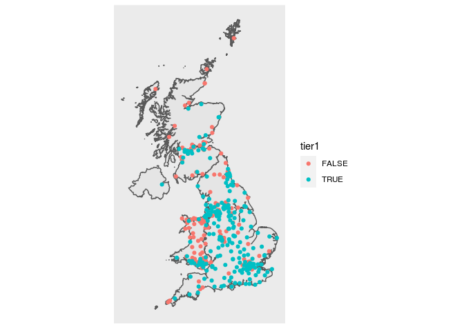

Arear
================

<!-- README.md is generated from README.Rmd. Please edit that file -->

# arear

<!-- badges: start -->

[](https://github.com/terminological/arear/actions)
[](https://codecov.io/gh/terminological/arear?branch=main)
<!-- badges: end -->

This package provides a suite of geo-spatial functions that were useful
during the response to the COVID-19 pandemic in the UK. It provides some
curated data relevant to hospital capacity in the NHS, and demographic
data for the UK at the beginning of the pandemic. Coupled with this are
a range of functions to simplify the management of mapping data between
different administrative geographies, at different levels of detail that
were involved in COVID-19 reporting. For mapping community case data to
hospital admissions data the library provides an algorithmic hospital
catchment area estimation based on label propagation, the methods for
which are described in detail here - AWAITING FINAL URL. Many of the
operations in the package involve time consuming calculations, which
only generally need to be performed once, so the package incorporates a
transparent filesystem caching layer to speed it all up.

## Installation

Arear is not yet on CRAN. You can install the development version from
[GitHub](https://github.com/terminological/arear) with the following
commands:

``` r
# install.packages("devtools")
devtools::install_github("terminological/arear")
```

## Example

Without this package accessing maps relevant to the UK requires knowing
where to look for various shape files, and then managing the various
differences between nomenclature and naming conventions. The package
provides a simple interface to downloading, extracting, standardising,
and caching the main UK maps. Getting and plotting a map for the UK
based on the administrative code in use is made relatively simple:

``` r
# devtools::load_all()
here::i_am("README.Rmd")
#> here() starts at /media/data/Git/arear
options("arear.download.dir"=rappdirs::user_cache_dir("arear-download"))
options("arear.cache.dir"=rappdirs::user_cache_dir("arear-vignette"))

library(arear)
library(sf)
#> Linking to GEOS 3.7.1, GDAL 2.2.2, PROJ 4.9.2; sf_use_s2() is TRUE

# list the available maps ids:
# arear::listStandardMaps()

map = arear::getMap("CTRY19")
#> using cached item: ~/.cache/arear-vignette/CTRY19-4c76523a56d19ec1a8fea7c3d89b0c97-e8ad913f081c0dbf1597ddd548bcd596.rda
nhshospitals = arear::surgecapacity %>% dplyr::filter(sector == "NHS Sector")

ggplot()+
  geom_sf(data=map)+
  geom_sf(data=nhshospitals, aes(colour=tier1))+
  arear::mapTheme()
```



## Next steps

Please check the getting-started vignette for more examples on the
available functions, including the catchment area algorithm.
