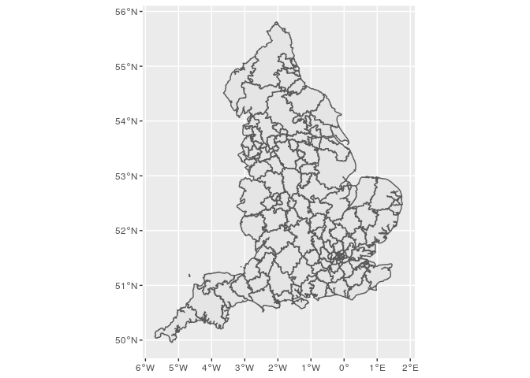

Arear
================

<!-- README.md is generated from README.Rmd. Please edit that file -->

# arear

<!-- badges: start -->

[](https://github.com/terminological/arear/actions)
[](https://codecov.io/gh/terminological/arear?branch=main)
<!-- badges: end -->

The goal of arear is to …

## Installation

You can install the released version of arear from
[CRAN](https://CRAN.R-project.org) with:

``` r
install.packages("arear")
```

And the development version from [GitHub](https://github.com/) with:

``` r
# install.packages("devtools")
devtools::install_github("terminological/arear")
```

## Example

There are a set of maps bundled:

``` r
# devtools::load_all()
here::i_am("README.Rmd")
#> here() starts at /media/data/Git/arear
options("arear.cache.dir"=here::here("data-raw/cache"))

library(arear)
library(sf)
#> Linking to GEOS 3.7.1, GDAL 2.2.2, PROJ 4.9.2

## basic example code
arear::listStandardMaps()
#>  [1] "WD11"          "WD19"          "LSOA11"        "MSOA11"       
#>  [5] "DZ11"          "CA19"          "HB19"          "LHB19"        
#>  [9] "CTYUA19"       "LAD19"         "LAD20"         "CCG20"        
#> [13] "NHSER20"       "PHEC16"        "CTRY19"        "LGD12"        
#> [17] "OUTCODE"       "GBR_ISO3166_2" "GBR_ISO3166_3"
```

Getting and plotting a map for the UK is simple:

``` r
map = arear::getMap("CTRY19")
#> using cached item: /media/data/Git/arear/data-raw/cache/CTRY19-6e27f3f3a3af4831b98f646a7ad9cff8-6f7bbb6475cd5d546146f041d41acaef.rda
nhshospitals = arear::surgecapacity %>% dplyr::filter(sector == "NHS Sector")
ggplot()+
  geom_sf(data=map)+
  geom_sf(data=nhshospitals,aes(colour=tier1))
```


But the main thing is creating a catchment area:

``` r

apiTrusts = readr::read_csv("https://api.coronavirus.data.gov.uk/v2/data?areaType=nhsTrust&metric=hospitalCases&format=csv&release=2021-03-01")
#> Parsed with column specification:
#> cols(
#>   areaCode = col_character(),
#>   areaName = col_character(),
#>   areaType = col_character(),
#>   date = col_date(format = ""),
#>   hospitalCases = col_double()
#> )

# There are quite a few mental health, community, specialist and children's trusts that we do not as yet have sensible capacity data for, and although they report COVID
# cases these are essentially incidental to the care of the patient.
# However at last look this list also includes NHS Nightingale hospitals which we have not included
# apiTrusts %>% select(areaCode,areaName) %>% distinct() %>% anti_join(arear::surgecapacity, by = c("areaCode"="trustId")) %>% View()

# The API output includes only NHS trusts in England
# there should be no NHS Trusts in this data that do not appear in the API.
# arear::surgecapacity %>% filter(nation == "England" & sector == "NHS Sector") %>% anti_join(apiTrusts, by = c("trustId"="areaCode")) %>% View()

sup = arear::surgecapacity %>% semi_join(apiTrusts, by = c("trustId"="areaCode"))
dem = arear::uk2019demographicsmap %>% filter(code %>% stringr::str_starts("E")) %>% left_join(arear::uk2019adultpopulation %>% select(-name,-codeType), by="code")

catchment = arear::createCatchment(
  supplyShape = sup, 
  supplyIdVar = trustId, 
  supplyVar = acuteBeds,
  demandShape = dem,
  demandIdVar = code, 
  demandVar = population,
  outputMap = TRUE
)
#> using cached item: /media/data/Git/arear/data-raw/cache/neighbourhood-cbd8d3b956388d66873e5fbab876bc30-1f0469b5931a334156ed70cfed0ab8e2.rda
#> although coordinates are longitude/latitude, st_contains assumes that they are planar
#> Warning in arear::createCatchment(supplyShape = sup, supplyIdVar = trustId, :
#> More than one supplier was found in a single region. These the first value will
#> be picked, and the total capacity combined, but as a result the catchment map
#> will be missing some values from the supplier list.
#> areas remaining: 32614;
#> growing into: 1496
#> areas remaining: 32441; growing into: 1734
#> areas remaining: 31754; growing into: 2638
#> areas remaining: 31080; growing into: 3348
#> areas remaining: 29898; growing into: 4177
#> areas remaining: 28721; growing into: 4940
#> areas remaining: 27032; growing into: 5726
#> areas remaining: 25152; growing into: 6423
#> areas remaining: 22856; growing into: 6949
#> areas remaining: 20129; growing into: 7312
#> areas remaining: 17646; growing into: 7418
#> areas remaining: 14944; growing into: 7158
#> areas remaining: 12244; growing into: 6484
#> areas remaining: 10017; growing into: 5575
#> areas remaining: 8189; growing into: 4795
#> areas remaining: 6537; growing into: 3948
#> areas remaining: 5098; growing into: 3123
#> areas remaining: 4114; growing into: 2541
#> areas remaining: 3177; growing into: 1982
#> areas remaining: 2443; growing into: 1557
#> areas remaining: 2016; growing into: 1247
#> areas remaining: 1554; growing into: 994
#> areas remaining: 1252; growing into: 797
#> areas remaining: 916; growing into: 543
#> areas remaining: 794; growing into: 467
#> areas remaining: 618; growing into: 356
#> areas remaining: 464; growing into: 252
#> areas remaining: 350; growing into: 204
#> areas remaining: 300; growing into: 161
#> areas remaining: 214; growing into: 114
#> areas remaining: 187; growing into: 88
#> areas remaining: 150; growing into: 76
#> areas remaining: 129; growing into: 72
#> areas remaining: 74; growing into: 29
#> areas remaining: 68; growing into: 22
#> areas remaining: 51; growing into: 8
#> areas remaining: 49; growing into: 5
#> areas remaining: 44; growing into: 0
#> Warning in arear::createCatchment(supplyShape = sup, supplyIdVar = trustId, : No
#> futher areas to grow into. Terminating early with missing areas - it looks like
#> 44 areas are not connected.
#> assembling catchment area map...
#> Registered S3 method overwritten by 'geojsonlint':
#>   method         from 
#>   print.location dplyr

ggplot(catchment$map)+geom_sf()
```



``` r

# catchment$map %>% View()
```
